# Phishing Email Project

## Project Overview
The Phishing Email Project aims to develop and evaluate machine learning models, including a neural network, to classify emails as either "phishing" or "legitimate." Given the prevalence of phishing attacks, this project provides a practical tool for distinguishing between safe and potentially harmful emails using data-driven methods.

Project team: This project was completed collaboratively by a group of SIT (Singapore Institute of Technology) students.

## Methodology

1. **Data Collection and Exploration**  
   A labeled dataset containing both legitimate (ham) and phishing (spam) emails was obtained from Kaggle, ensuring a balanced dataset for training. Initial data exploration included:  
   - **Visualization**: A pie chart highlighted the class imbalance between ham and spam emails, with ham emails comprising 79% of the dataset.
   - **Word Clouds**: Frequently used words in spam emails (e.g., "offer," "save") versus legitimate emails (e.g., "schedule," "attach") provided insights into common phishing terms.

2. **Data Preprocessing**  
   Steps to clean and prepare the data:  
   - **Stopwords Removal**: Removed stopwords using NLTK’s default list, supplemented with additional common email terms.
   - **URL Replacement**: Replaced links with 'URL' tokens to highlight frequency rather than specific content.
   - **Punctuation Removal**: Eliminated punctuation to reduce noise.
   - **Stemming**: Applied stemming to focus on root words.
   - **Tokenization**: Converted email text into individual tokens.
   - **Vectorization**: Used TF-IDF and Word2Vec for converting text into numerical format.

3. **Feature Engineering**  
   Key feature engineering techniques include:  
   - **TF-IDF**: Highlights important words while downplaying common ones, helping focus on unique phishing terms.
   - **Word2Vec**: Maps semantically similar words closer in vector space.
   - **N-Grams**: Analyzes word sequences, such as bigrams, to capture phishing patterns (e.g., "verify account").

4. **Model Development**  
   The project explored both traditional and neural network models:  
   - **Logistic Regression**: Provided a linear baseline.
   - **Random Forest**: Ensemble method capturing feature importance effectively.
   - **Naive Bayes**: Effective with discrete data, suited to text analysis.
   - **k-Nearest Neighbors (k-NN)**: Non-parametric method useful for small datasets.
   - **XGBoost**: Ensemble gradient boosting, optimized with GridSearch for best hyperparameters.

   **Neural Network Model**  
   A hybrid CNN-RNN neural network was created to capture both local word patterns and long-range dependencies. The model integrates:  
   - **CNN Layers**: Extract local patterns like common phrases.
   - **RNN Layers**: Capture the sequence and flow of words for context.  
   
   The CNN-RNN model achieved an average accuracy of 87.08% over ten fold which is lower than the standard machine learninng algorithm. This could be largely because of our smaller dataset.

5. **Model Evaluation**  
   Models were evaluated using:  
   - **Accuracy**: Overall correct classifications.
   - **Precision, Recall, and F1 Score**: Balanced metrics to evaluate phishing detection and minimize false positives.
   - **Cross-validation**: Validated generalization across data subsets. By repeating n times, using a different fold as the test set each time, and the results are averaged.

6. **Data Visualisation**
   The results were represented using:
   - **Precision-Recall Curve**: Illustrated the trade-off between precision and recall across different classification thresholds, this is useful for evaluating models in cases with imbalanced data by showing the balance between capturing true positives and minimizing false positives.
   - **Bar Graph for Accuracy Comparison**: Compared accuracy across all models to identify which performed best in classifying emails. This bar graph is a straightforward view of overall accuracy scores for each machine learning algorithm.
   - **F1 Distribution Score**: Showed F1 scores across multiple cross-validation folds for each model, examining each model's consistency and reliability in achieving balanced precision and recall scores
   - **Feature Importance Graph**: Displayed the most influential features (e.g., specific words or patterns) that contributed to classification accuracy.

## Analysis of Results
Here’s a visual representation of the sentiment analysis results:

### <ins>Initial Data Exploration:<ins>
   1. Spam vs. Ham Distribution - The dataset consists of 79.09% ham (legitimate emails) and 20.91% spam, indicating a class imbalance with ham messages significantly outnumbering spam. This imbalance may lead to higher false negatives for models like Logistic Regression, Naive Bayes, and KNN, which do not inherently handle imbalanced data well.
      
   2. Keyword Analysis with Word Clouds - This visualizations highlight the most frequent words in spam and ham messages, offering a glimpse into the typical language used in each category.
      * Legitmiate - Prominent words found in this category are business-related terms such as "hou," "ect," "contract," "time," "file," and "schedule."
      * Spam - Common keywords in this category include terms like "nbsp," "offer," "invest," "online," "service," and "market."
      #### WordCloud - Legitimate
      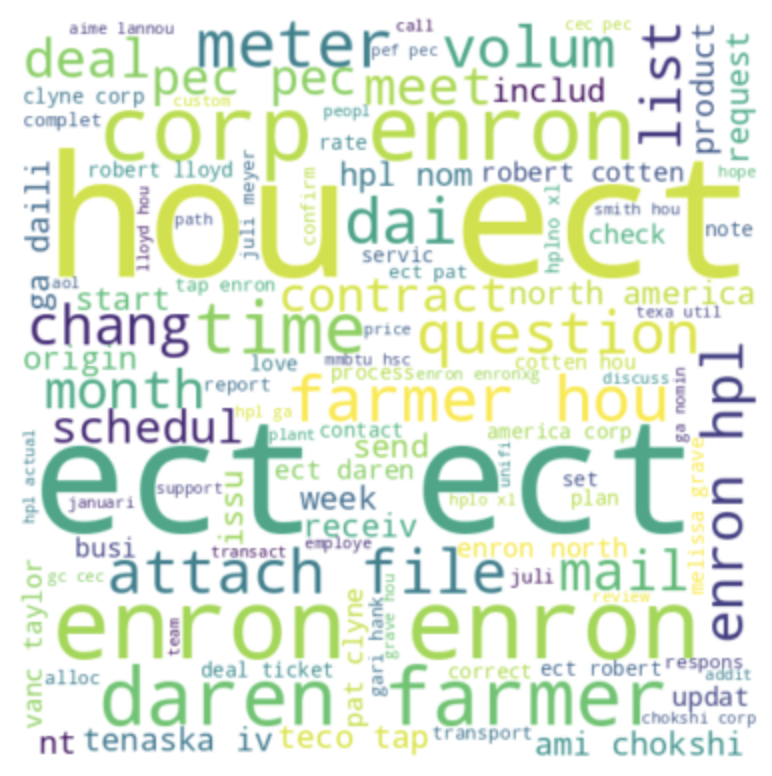

      #### WordCloud - Spam
      

### <ins>Model Analysis: Neural Network Performance (TF-IDF)<ins>
   #### Model Loss Over Epochs
   * The training loss and validation loss over 100 epochs show that the model gradually reduces loss for both the training and validation sets
   * The initial high fluctuations in validation loss indicate some instability in the early training stages, possibly due to the learning rate or class imbalance.
   * Around 30 epochs, the validation loss stabilizes and follows a similar downward trend to the training loss, suggesting the model is learning effectively without significant overfitting.
  
   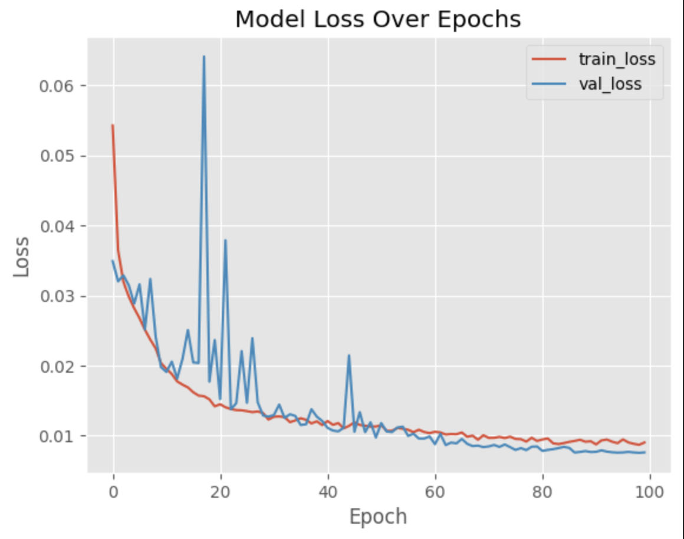

   #### Model Accuracy Over Epochs
   * Some fluctuations in validation accuracy early on suggest sensitivity to class imbalance, but these stabilize with further training.
   * The mean accuracy across 10 folds is approximately 87.08%, which indicates good overall model performance.

   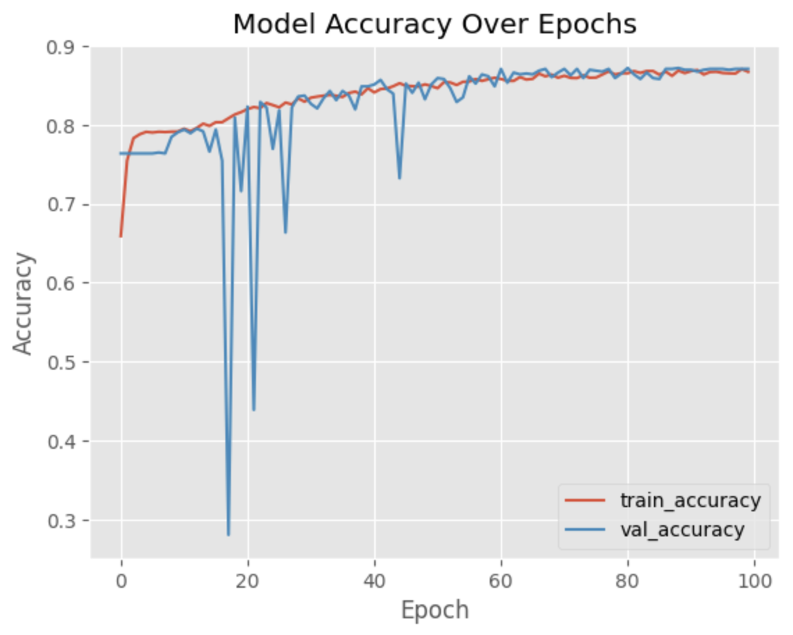

### <ins>Model Analysis: Machine Learning Algorithms Performance (TF-IDF)<ins>
   ### Performance Metrics Summary
   * XGBoost achieves the highest average accuracy (0.93), F1 score (0.82), and strong precision (0.89), demonstrating that it effectively leverages TF-IDF features.
   * Random Forest also shows robust performance with an average F1 score of 0.77 and high precision (0.81), validating its effectiveness with TF-IDF.
   * Logistic Regression provides a good balance with an average F1 score of 0.76, though slightly lower recall indicates it may benefit from further tuning.
   * KNN models perform less effectively, with lower recall and F1 scores, highlighting the limitations of distance-based methods with sparse and high-dimensional TF-IDF features.

   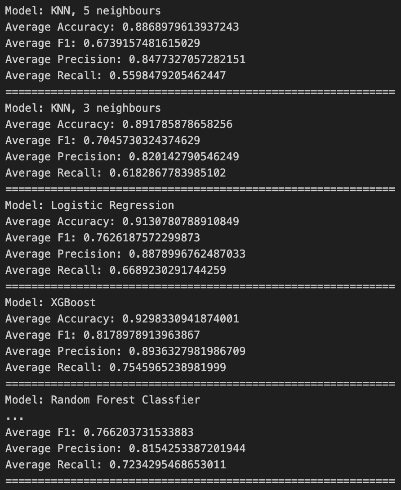
   
   ### Precision-Recall Curve - TF-IDF
   * The Precision-Recall curve shows that XGBoost and Random Forest maintain high precision and recall values across a wide range of thresholds, indicating strong capability to detect phishing emails while minimizing false positives.
   * Logistic Regression performs well but shows slightly lower recall, suggesting it might miss some phishing emails compared to ensemble models.
   * KNN models exhibit a drop in precision at higher recall values, likely due to their sensitivity to sparse feature representations like TF-IDF, which may reduce their effectiveness in classifying phishing emails.

   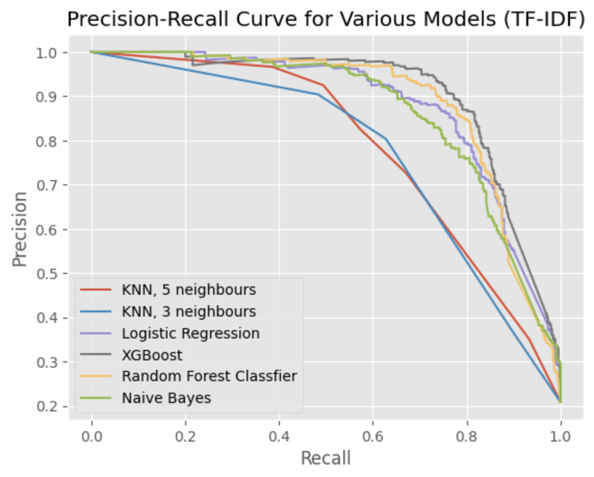

   ### F1 Score Distribution Across Models - TF-IDF
   * XGBoost and Random Forest consistently achieved the highest F1 scores, with tight distributions, indicating stable performance. These models benefit from TF-IDF’s ability to capture important words that are highly indicative of phishing emails.
   * Logistic Regression also performs well but with slightly more variance, showing it may be more sensitive to the balance between spam and ham terms.
   * KNN models, particularly with 5 neighbors, have the lowest F1 scores, indicating they struggle with TF-IDF features, likely due to the high dimensionality of the feature space, which affects distance-based models.

   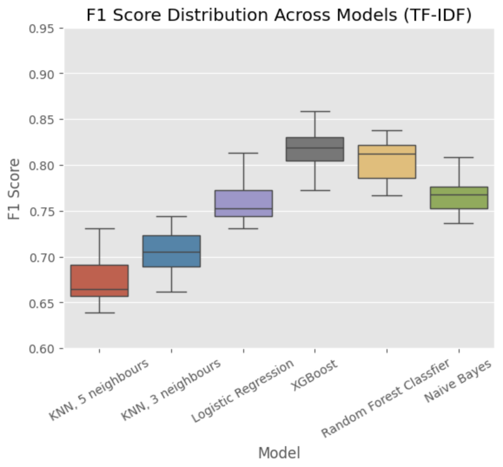

### <ins>Model Analysis: Machine Learning Algorithms Performance (Word2Vec)<ins>
   ### Performance Metrics Summary - Word2Vec
   * XGBoost achieves the highest accuracy (0.96) and F1 score (0.90), demonstrating its adaptability to both semantic and frequency-based features. This high F1 score with Word2Vec aligns with its performance in TF-IDF, marking it as a top performer across feature engineering techniques.
   * Random Forest also performs well with an average F1 score of 0.86, maintaining its strong performance across both embeddings. This consistency shows that Random Forest can effectively manage different feature types.
   * KNN models deliver moderate performance but struggle with both feature types, suggesting that KNN may not be the best fit for text classification.
   * Logistic Regression has the lowest F1 score and recall with Word2Vec, likely due to its limited ability to interpret dense, semantic vectors. Its stronger results with TF-IDF highlight a preference for simpler, frequency-based features.

   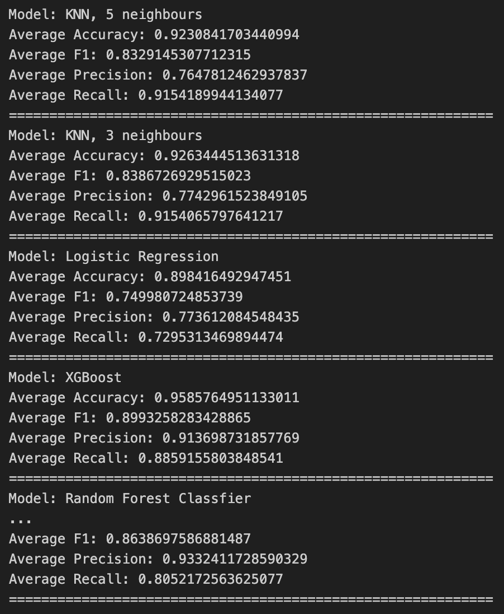
   
   ### Precision-Recall Curve - Word2Vec
   * The Precision-Recall curves reveal that XGBoost and Random Forest achieve high precision and recall, maintaining strong performance across various thresholds. This shows that both model is efficient detecting phishing email with minimal trade-offs between precision and recall.
   * KNN models show a dip in precision at higher recall values, which is consistent across both Word2Vec and TF-IDF, highlighting challenges in distinguishing subtle class differences in dense and sparse feature spaces alike.
   * Logistic Regression displays a less favorable precision-recall curve with Word2Vec, as compared to its more robust curve with TF-IDF. This suggests that it may be better suited to simpler, linear representations like TF-IDF rather than the dense, contextual information in Word2Vec embeddings.

   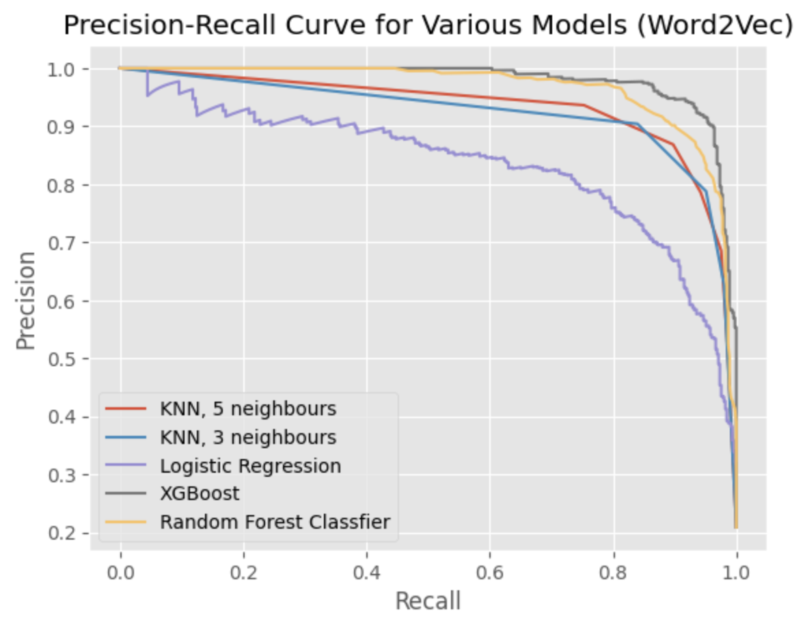

   ### F1 Score Distribution Across Models - Word2Vec
   * The F1 score distribution shows that XGBoost and Random Forest maintain high and consistent F1 scores with Word2Vec. This performance aligns the result using TF-IDF, further proving that the ensemble models handle both frequency-based and semantic features well.
   * KNN models achieve moderate F1 scores but with less consistency compared to ensemble models. This pattern is similar to their performance with TF-IDF, suggesting that KNN’s distance-based approach is less effective for both high-dimensional sparse data (TF-IDF) and dense semantic vectors (Word2Vec).
   * Logistic Regression has lower F1 scores with Word2Vec, indicating it may struggle to effectively utilize the complex relationships captured by dense embeddings. This is an indication that linear features are better suited to Logistic Regression’s capabilities.

   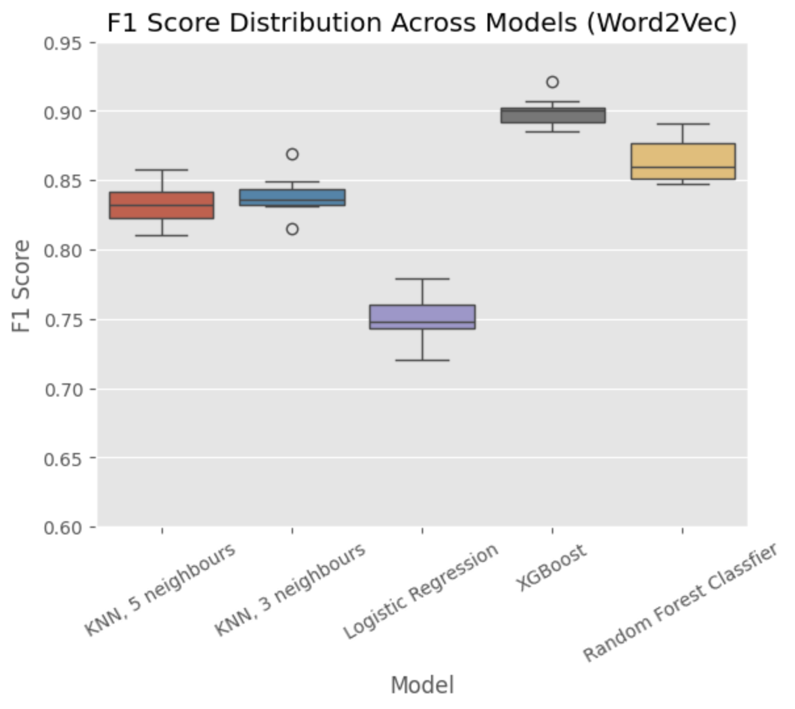

## Conclusion
In this analysis, we evaluated multiple machine learning algorithms, including a hybrid neural network (CNN-RNN) model, to detect phishing emails using two feature engineering techniques: TF-IDF and Word2Vec. The results provide insights into the relative effectiveness of each model and feature representation, with a focus on handling the inherent class imbalance in the dataset.

1. Model Performance Across Representations:

   * Accuracy Comparison: The Word2Vec representation generally resulted in higher accuracy across models compared to TF-IDF, with ensemble models like XGBoost and Random Forest Classifier showing the strongest performance. This trend suggests that Word2Vec’s semantic embeddings are advantageous in capturing contextual meaning, which enhances model accuracy, whereas TF-IDF focuses more on word frequency and importance, potentially limiting contextual understanding.
     
   * Hybrid Neural Network (CNN-RNN): The CNN-RNN model performed competitively with traditional algorithms. However, it fell short compared to XGBoost and Random Forest Classifier, which could be largely attributed to the relatively small dataset available. Deep learning models often benefit from larger datasets, where they can leverage their complex architecture to capture intricate patterns in the data.
  
   **Note**: *Naive Bayes is not compatible with Word2Vec embeddings because Word2Vec produces continuous, dense vector representations, while Naive Bayes operates under the assumption of independence between discrete features.*

2. Feature Importance:

For models that allow interpretation of feature importance, such as XGBoost, Logistic Regression, and Random Forest, certain keywords strongly correlated with spam detection were identified. For instance, terms like "offer," "claim," and "guarantee" frequently ranked high in importance, signaling their association with spam content. Each model's feature importance ranking reinforces these terms as consistent indicators of spam, providing valuable insights for future model tuning and spam detection strategies.

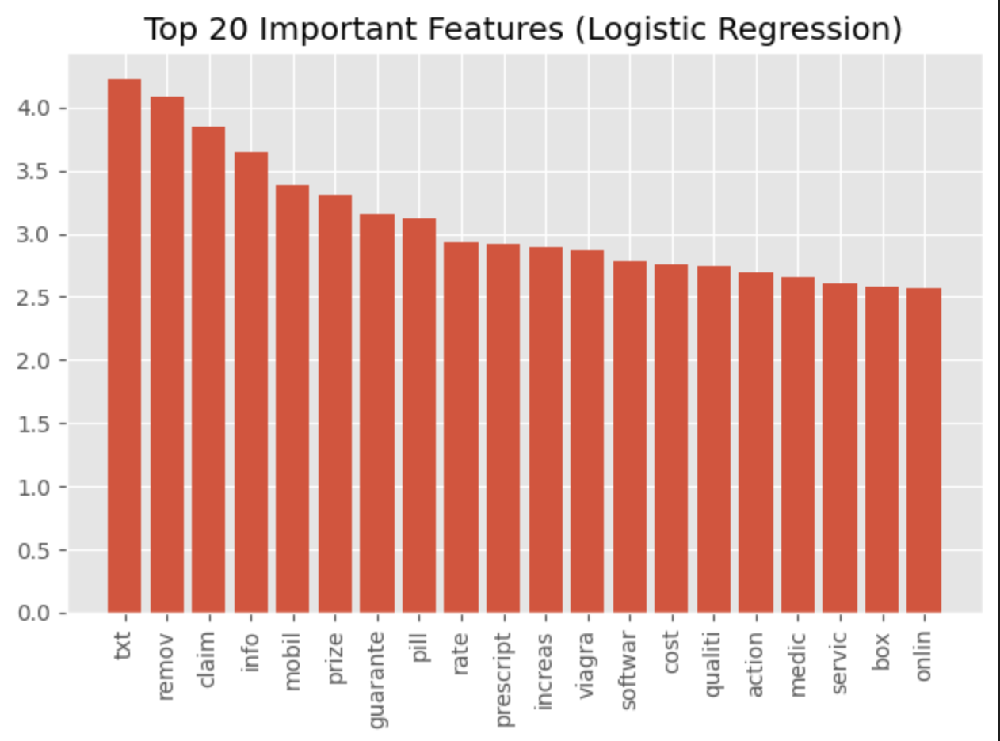
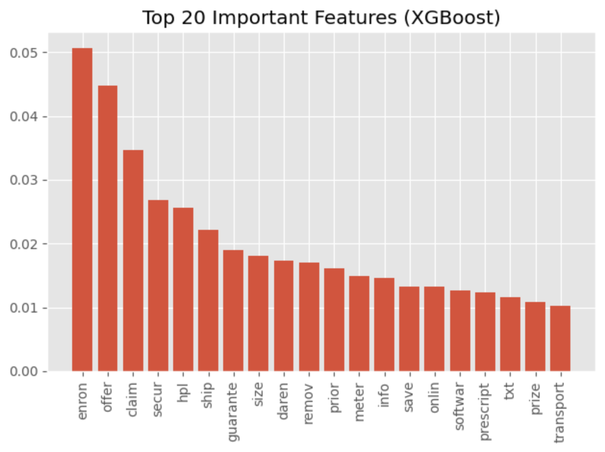
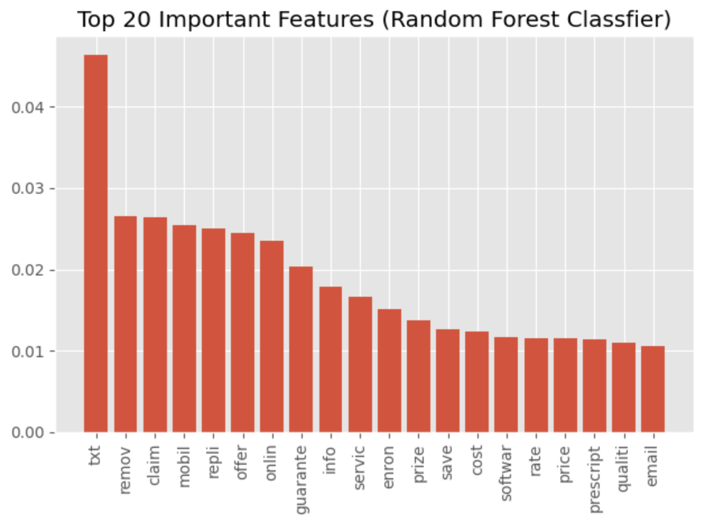
   

## Future Work
Future directions include:
- Expanded Datasets: Especially for complex models like CNN-RNN, a bigger dataset will be beneficial as it helps the model generalize better and reducing overfitting.
- Experiment with Advanced Embeddings: Incorporating more advanced word embeddings such as BERT or ELMo could further improve the model's ability to understand context, especially for nuanced phishing emails.
- Implement an Ensemble Approach: Rather than relying on a single model, combining the strengths of multiple models through ensembling could improve overall performance. For instance, using a voting or stacking approach with models like XGBoost, Random Forest, and CNN-RNN might help balance precision and recall effectively.
